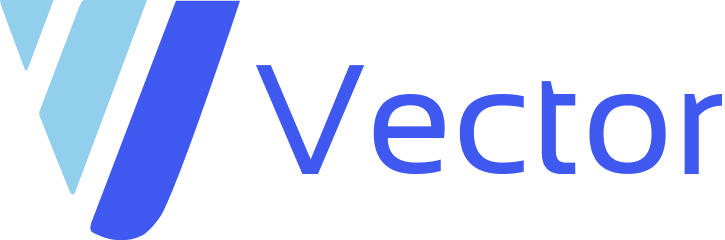

# Czym jest Dziennik Vector?
Dziennik Vector to nowoczesna implementacja dziennika szkolnego, stawiająca na automatyzacje i optymalizacje monotonnych, powtarzających się zadań.

***

## Funkcje
Spis treści opisu instrukcji różnych funkcji dziennika dla nauczyciela i ucznia.

* [Nauczyciel](https://github.com/UltimateDoge5/Vector/wiki/Nauczyciel)
    - [Oceny](https://github.com/UltimateDoge5/Vector/wiki/Nauczyciel#oceny)
    - [Frekwencja](https://github.com/UltimateDoge5/Vector/wiki/Nauczyciel#frekwencja)
    - [Plan lekcji](https://github.com/UltimateDoge5/Vector/wiki/Nauczyciel#plan-lekcji)
    - [Zadania](https://github.com/UltimateDoge5/Vector/wiki/Nauczyciel#zadania)
    - [Użytkownicy](https://github.com/UltimateDoge5/Vector/wiki/Nauczyciel#użytkownicy)
        - [Uczniowie](https://github.com/UltimateDoge5/Vector/wiki/Nauczyciel#uczniowie)
        - [Nauczyciele](https://github.com/UltimateDoge5/Vector/wiki/Nauczyciel#nauczyciele)
    - [Lekcje](https://github.com/UltimateDoge5/Vector/wiki/Nauczyciel#lekcje)
        - [Przedmioty](https://github.com/UltimateDoge5/Vector/wiki/Nauczyciel#przedmioty)
        - [Zajęcia](https://github.com/UltimateDoge5/Vector/wiki/Nauczyciel#zajęcia)
    - [Klasy](https://github.com/UltimateDoge5/Vector/wiki/Nauczyciel#klasy)
    - [Ogłoszenia](https://github.com/UltimateDoge5/Vector/wiki/Nauczyciel#ogłoszenia)

* [Uczeń](https://github.com/UltimateDoge5/Vector/wiki/Uczeń)
    - [Oceny](https://github.com/UltimateDoge5/Vector/wiki/Uczeń#oceny)
    - [Frekwencja](https://github.com/UltimateDoge5/Vector/wiki/Uczeń#frekwencja)
    - [Plan lekcji](https://github.com/UltimateDoge5/Vector/wiki/Uczeń#plan-lekcji)
    - [Zadania](https://github.com/UltimateDoge5/Vector/wiki/Uczeń#zadania)
